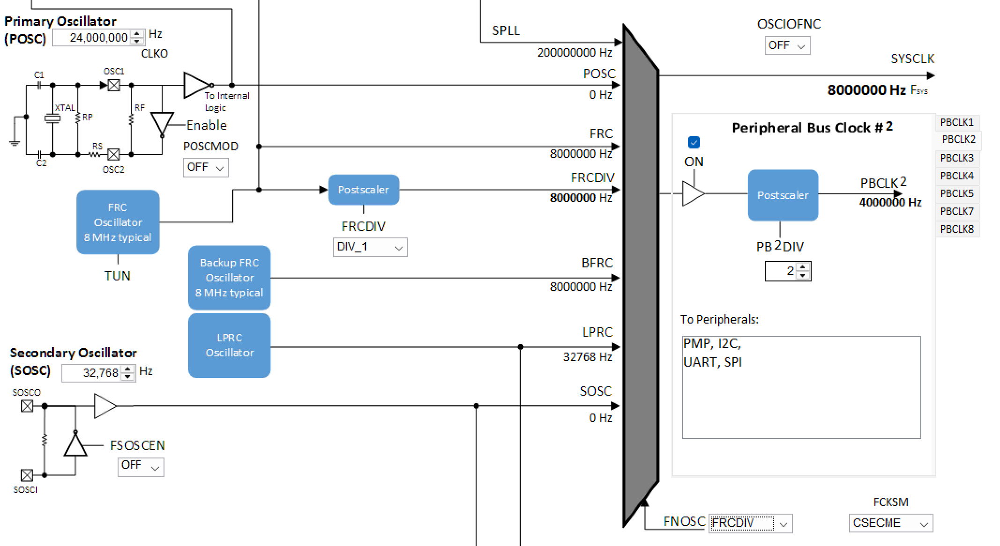
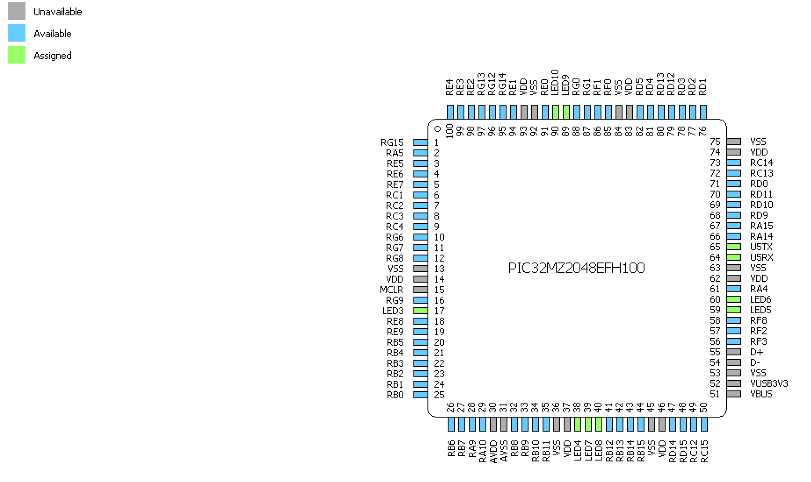

# CS 654 Final Project

### Contributors: Eric Nohara-LeClair, Yin-Ching Lee, Jason Ha

---

## Table of Contents

- [Project Description](#project-description)
- [Procedure](#procedure)
- [MPLAB Harmony](#mplab-harmony)
- [Board Configuration](#mplab-harmony-board-configuration)
- [Demo Videos](#demo-videos)
- [How to Compile and Run](#how-to-compile-and-run)
- [Known Issues](#known-issues)
- [Project Structure](#project-structure)

## Project Description

- Remake of lab 3b with UART serial communication with the board as the client and the laptop running a server script
- Rather than sending ASCII messages, we send raw bytes from the server to the board
  - The server reads in a file's raw bytes byte by byte, generates packets of data, and sends these packets of bytes to the client board
  - The client board recieves these bytes, then processes the bytes into their bit representation, displaying the bits in each byte on the 8 LEDs
  - The cleint board then sends back a ACK/NACK byte following the same format as the lab
- The server and client work with the troll, using a start byte, CRC, message length, and timeout of 1 second to validate data
- The server allows configuration:
  - -f: allows you to specify the filename in the current directory to send to the board in bytes
  - -p: allows you to specify the packet size for the byte packets send to the board
  - -d: allows you to specify the duration that the LEDs flash when representing a single byte

## Procedure

- Read over datasheets for the given board, PIM, and microchip
- Learn how to use MPLAB Harmony by watching the tutorials provided below
- Configure needed pins for TMR2, TMR3, UART5, LED3, LED4, LED5, LED6, LED7, LED8, LED9, LED10 in MPLAB Harmony
- Generate the firmware peripheral files using MPLAB Harmony
- Edit board code from lab 3 to use the UART and timer functions defined in the generated firmware
  - TMR2 used for the 1 second timeout for data validity checking
  - TMR3 used for flashing the LEDs for a specified amount of time
  - UART5 used to send and recieve data to and from the server
  - Edit the lab code to receive a config packet to configure the message buffer size and LED flash duration
  - Edit the data receive function to convert a byte to bits and flash the necessary LEDs after receiving a packet
- Edit byte receiving logic to allow for a config packet and to recieve packets of raw bytes
- Edit the lab3_server.c file from lab 3 to break up files of bytes into packets and send them to the board
  - Add a config packet to send to the board before the bytes
- Test and bug fixes

## MPLAB Harmony

- Used MPLAB Harmony to generate firmware needed to interact with the 16/32 explorer board's LEDs, timers, and UART
- Used [Explorer 16/32 Schematics Datasheet](https://ww1.microchip.com/downloads/aemDocuments/documents/OTH/ProductDocuments/BoardDesignFiles/Explorer_16_32_Schematics_R6_3.pdf) to find the pins that the PIM uses to interact with the board
- Used [PIM Datasheet](https://ww1.microchip.com/downloads/aemDocuments/documents/OTH/ProductDocuments/Brochures/50002359A.pdf) to find how the pins on the 100 pin PIC32MZ interfaced with the 100 pin PIM
- Used [PIC32MZ Datasheet](https://www.mouser.com/datasheet/2/268/PIC32MZ_Embedded_Connectivity_with_Floating_Point_-3314567.pdf) to find which registers and pins need to be configured in MPLAB Harmony in order to set up timers, LEDs, and UART
- Informative videos used:
  - [Setting up LEDs](https://www.youtube.com/watch?v=dZkVQvZ6C1s&ab_channel=Nezbrun)
  - [Setting up UART](https://www.youtube.com/watch?v=k_dsdO2kWgg&t=87s&ab_channel=Nezbrun)

## MPLAB Harmony Board Configuration

### Clock Configuration

- Set FN OSC to FRCDIV (internal oscillator) using the Clock Diagram
  

### LED Configuration

- <strong>LED3: </strong>Set RA0 to GPIO output
- <strong>LED4: </strong>Set RA1 to GPIO output
- <strong>LED5: </strong>Set RA2 to GPIO output
- <strong>LED6: </strong>Set RA3 to GPIO output
- <strong>LED7: </strong>Set RF13 to GPIO output
- <strong>LED8: </strong>Set RF12 to GPIO output
- <strong>LED9: </strong>Set RA6 to GPIO output
- <strong>LED10: </strong>Set RA7 to GPIO output

### Timer Configuration

- <strong>TMR2: </strong>
  - Enable interrupts
  - 1:256 prescalar
  - Clock source = internal peripheral clock
  - Time unit = millisecond
  - Time = 1000
- <strong>TMR3: </strong>
  - Enable interrupts
  - 1:16 prescalar
  - Clock source = internal peripheral clock
  - Time unit = millisecond
  - Time = 50

### UART Configuration

- <strong>UART5 RX: </strong>Set RF4 to U5RX
- <strong>UART5 TX: </strong>Set RF5 to U5TX
- <strong>UART Config Options: </strong>
  - 1 stop bit
  - 8 data bit no parity
  - UxTX and UxRX pins enabled
  - 9600 baud rate
- <strong>STDIO: </strong>Add a STDIO block and connect it to the UART5 block in the project graph

### Generating the Firmware

- Click the generate button after board configuration
- This will generate the firmware in the ./Source Files/config/default/peripheral directory, and the header files in the ./Header Files/config/default/peripheral directory
- Call `SYS_Initialize ( NULL );` which calls the firmware functions to initialize everything

### Board Pin Configuration



## Demo Videos

- [Demo Video 1](./assets/demo1.MOV)
- [Demo Video 2](./assets/demo2.MOV)

## How to Compile and Run

```
make all
./lab3_server /dev/tty<dev_num> -t 0.1 -p 10 -d 1 -f counting
```

Make sure to flash the board from MPLABX IDE before running the server executable.

## Known Limitations

- After the server finishes sending the contents of a file, it sends an END_OF_DATA packet to the client. The client waits for this packet and exits execution upon receiving. It is possible for this packet to exist within a file of bytes being sent. In this case, the client will react to the packet and exit before receiving the rest of the data
- Must restart board program after the server completes before running again

## Requirements

- MPLABX IDE v6.20
  - Download for the PIC32 family of devices
  - If unsure, just download for all families
- MPLAB Code Configurator v5
- MPLAB Harmony
  - Navigate to Tools>Embedded>MPLAB Code Configurator v5
  - The screen should have a link to download MPLAB Harmony for your device version
- Debugger
  - There is a built in debugger on the Explore 16/32 board

## Project Structure

```
.
├── assets
│   ├── demo1.MOV
│   └── demo2.MOV
├── final_project.X
│   ├── build
│   │   └── default
│   │       ├── debug
│   │       │   └── _ext
│   │       │       ├── 1171490990
│   │       │       │   ├── exceptions.o
│   │       │       │   ├── exceptions.o.d
│   │       │       │   ├── initialization.o
│   │       │       │   ├── initialization.o.d
│   │       │       │   ├── interrupts.o
│   │       │       │   └── interrupts.o.d
│   │       │       ├── 1360937237
│   │       │       │   ├── main.o
│   │       │       │   └── main.o.d
│   │       │       ├── 163028504
│   │       │       │   ├── xc32_monitor.o
│   │       │       │   └── xc32_monitor.o.d
│   │       │       ├── 1865200349
│   │       │       │   ├── plib_evic.o
│   │       │       │   └── plib_evic.o.d
│   │       │       ├── 1865254177
│   │       │       │   ├── plib_gpio.o
│   │       │       │   └── plib_gpio.o.d
│   │       │       ├── 1865657120
│   │       │       │   ├── plib_uart5.o
│   │       │       │   └── plib_uart5.o.d
│   │       │       ├── 60165520
│   │       │       │   ├── plib_clk.o
│   │       │       │   └── plib_clk.o.d
│   │       │       └── 60181895
│   │       │           ├── plib_tmr2.o
│   │       │           ├── plib_tmr2.o.d
│   │       │           ├── plib_tmr3.o
│   │       │           └── plib_tmr3.o.d
│   │       └── production
│   │           └── _ext
│   │               ├── 1171490990
│   │               │   ├── exceptions.o
│   │               │   ├── exceptions.o.d
│   │               │   ├── initialization.o
│   │               │   ├── initialization.o.d
│   │               │   ├── interrupts.o
│   │               │   └── interrupts.o.d
│   │               ├── 1360937237
│   │               │   ├── main.o
│   │               │   └── main.o.d
│   │               ├── 163028504
│   │               │   ├── xc32_monitor.o
│   │               │   └── xc32_monitor.o.d
│   │               ├── 1865200349
│   │               │   ├── plib_evic.o
│   │               │   └── plib_evic.o.d
│   │               ├── 1865254177
│   │               │   ├── plib_gpio.o
│   │               │   └── plib_gpio.o.d
│   │               ├── 1865657120
│   │               │   ├── plib_uart2.o
│   │               │   ├── plib_uart2.o.d
│   │               │   ├── plib_uart5.o
│   │               │   └── plib_uart5.o.d
│   │               ├── 60165520
│   │               │   ├── plib_clk.o
│   │               │   └── plib_clk.o.d
│   │               └── 60181895
│   │                   ├── plib_tmr2.o
│   │                   ├── plib_tmr2.o.d
│   │                   ├── plib_tmr3.o
│   │                   └── plib_tmr3.o.d
│   ├── config
│   │   └── default
│   │       ├── default.mhc
│   │       ├── peripheral
│   │       │   ├── clk
│   │       │   │   ├── plib_clk.c
│   │       │   │   └── plib_clk.h
│   │       │   ├── evic
│   │       │   │   ├── plib_evic.c
│   │       │   │   └── plib_evic.h
│   │       │   ├── gpio
│   │       │   │   ├── plib_gpio.c
│   │       │   │   └── plib_gpio.h
│   │       │   ├── tmr
│   │       │   │   ├── plib_tmr2.c
│   │       │   │   ├── plib_tmr2.h
│   │       │   │   ├── plib_tmr3.c
│   │       │   │   ├── plib_tmr3.h
│   │       │   │   └── plib_tmr_common.h
│   │       │   └── uart
│   │       │       ├── plib_uart5.c
│   │       │       ├── plib_uart5.h
│   │       │       └── plib_uart_common.h
│   │       ├── stdio
│   │       │   └── xc32_monitor.c
│   │       ├── definitions.h
│   │       ├── device.h
│   │       ├── exceptions.c
│   │       ├── harmony-manifest-success.yml
│   │       ├── initialization.c
│   │       ├── interrupts.c
│   │       ├── interrupts.h
│   │       ├── p32MZ2048EFH100.ld
│   │       └── toolchain_specifics.h
│   ├── debug
│   │   └── default
│   ├── dist
│   │   └── default
│   │       ├── debug
│   │       │   ├── final_project.X.debug.elf
│   │       │   ├── final_project.X.debug.map
│   │       │   └── memoryfile.xml
│   │       └── production
│   │           ├── final_project.X.production.elf
│   │           ├── final_project.X.production.hex
│   │           ├── final_project.X.production.map
│   │           └── memoryfile.xml
│   ├── nbproject
│   │   ├── private
│   │   │   ├── configurations.xml
│   │   │   └── private.xml
│   │   ├── Makefile-default.mk
│   │   ├── Makefile-genesis.properties
│   │   ├── Makefile-impl.mk
│   │   ├── Makefile-local-default.mk
│   │   ├── Makefile-variables.mk
│   │   ├── configurations.xml
│   │   └── project.xml
│   ├── Makefile
│   ├── final_project.mc3
│   ├── main.c
│   ├── mcc-manifest-autosave.yml
│   └── mcc-manifest-generated-success.yml
├── utils
│   └── convert_to_8bit.py
├── Makefile
├── Makefile.pc
├── README.md
├── generate_sample_file.c
├── lab3.h
├── lab3_server.c
├── lab3_troll.c
├── lab3_troll.h
├── output
├── pc_crc16.c
├── pc_crc16.h
└── serialdebug.c
```
